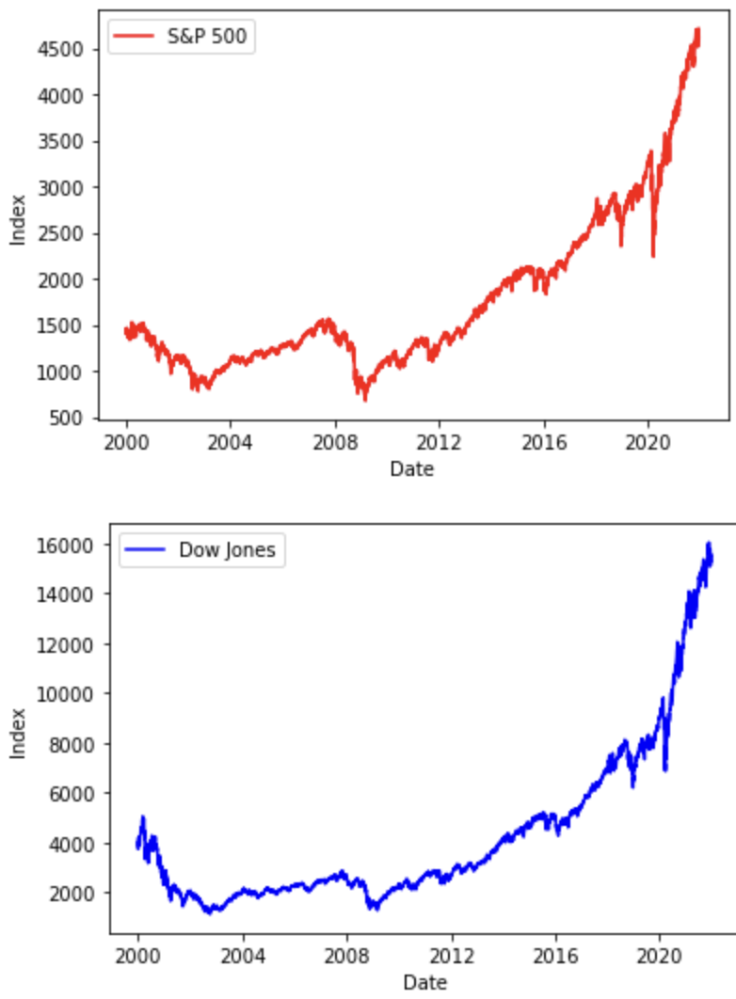
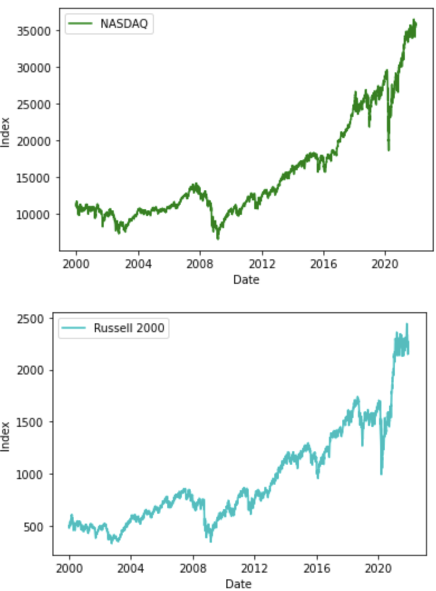
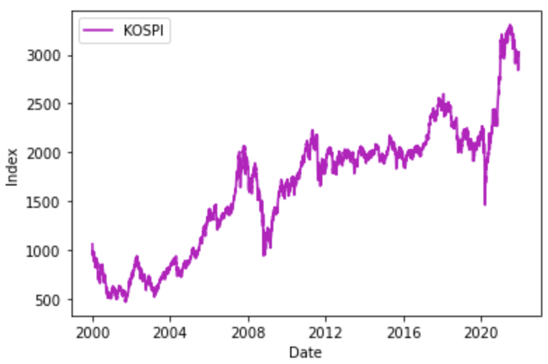
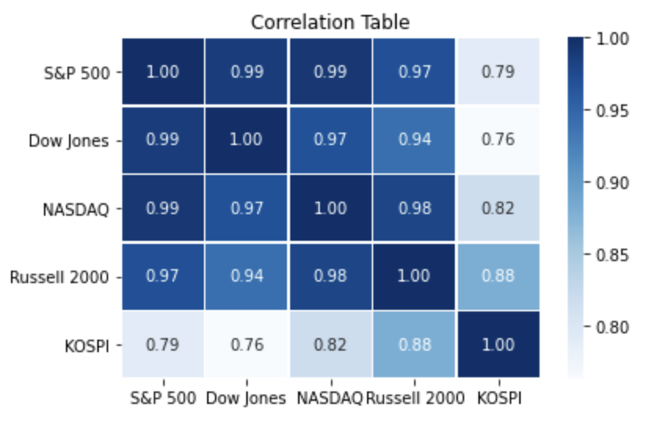
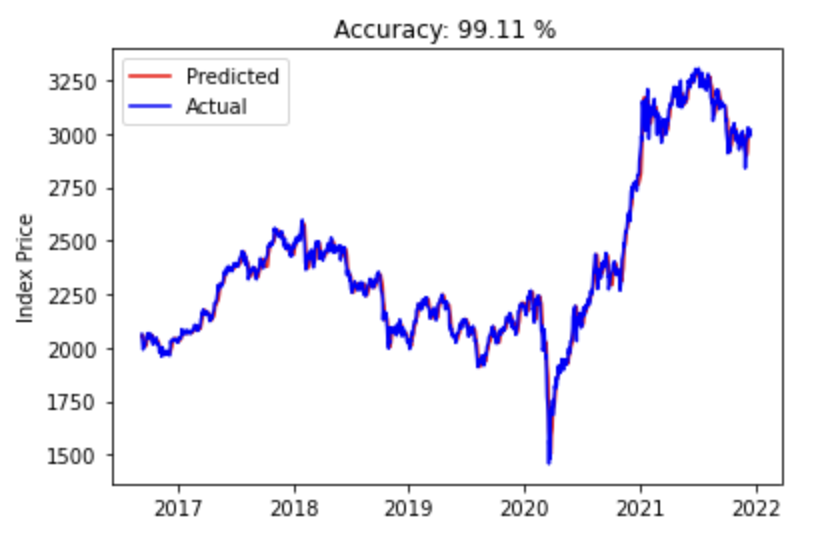
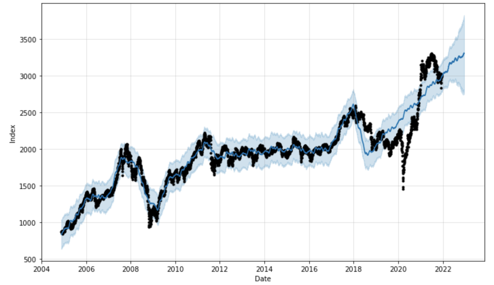
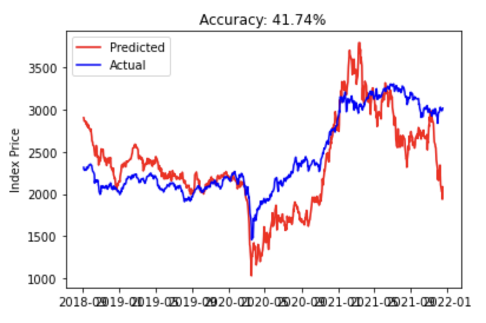

# 16101894 안재홍 Project1 : IndexCorrelation&Prediction

* **Note**: yfinance 라이브러리를 이용하여 데이터를 받아오는 방법은 https://gist.github.com/intandeay 를 참고하였음을 알려드립니다.

해당 프로젝트에서는 2000년 1월 4일 부터 2021년 12월 17일까지의 모든 지수데이터를 가져와 진행하였습니다.

Index는 한국의 대표 지수 **KOSPI**와 미국의 지수 중 **S&P 500, Dow Jones, NASDAQ 그리고 Russell 2000**을 이용하였습니다.

1. 각 지수 데이터로 각각의 데이터프레임을 만들은 후, 2000년부터 2021년까지의 그래프를 그려보았습니다. 

   밑의 그림을 보면, 시각적으로는 미국 지수들끼리는 유사도가 높아 보이지만, **KOSPI**는 *volatility*가 높아 보이고, 연관성이 미국 지수들과 높아 보이지 않아서

   상관계수를 구해보는 작업을 해보았습니다.
   
    
   
   
   
   

2. 각각의 데이터 프레임을 하나로 *concatenate* 하고 상관계수를 구해보았습니다. (단, 해당 상관계수는 *Pearson correlation coefficient* 입니다.)

위 table을 해석해보면, **KOSPI**와 다른 미국 지수들간 **강한 양의 상관관계**가 있다고 할 수 있다. 하지만, 그중에서 **KOSPI**는 **Russell 2000**과 가장 높은 상관관계를 보인다고 할 수 있다. 

3. 위 사진은 **KOSPI** 지수의 과거의 5일, 20일, 60일, 120일 그리고 240일 *Moving Average*를 이용하여, **Linear Regression Model**로 **Prediction**한 그래프이다. 

   총 기간의 75%를 *training*하고 나머지 25%을 *testing*하였다. 위에 그림에서 보이는 거와 같이 정확도는 99.11%를 보여준다.

   정확도의 계산은 *R^2*을 이용하여 계산하였다.   

   

4.  위 그림은 **Facebook**의 시계열데이터 라이브러리인 *fbprophet*을 이용한 것이다. 

   이전 그림에서는 dataset이 주어지지 않아, forecasting하기가 힘들었다. 하지만, *fbprophet*에서는 daily and yearly의 계절성을 고려하여,

   forecasting하기 쉽게 되어있어, 표현해보았다. 

   하지만, 2018년도 이전까지는 *outlier*가 많이 보이지않고 예측의 정확성이 있는데에 비해, 2018년도 이후부터는 *outlier*가 점차 증가하다가

   2020년 COVID-19에 의한 *Great Lockdown*에서는 예측치가 맞은게 없을 정도로 예측 정확성이 좋지 못함을 알 수 있다. 

   하지만, fbprophet의 모델에 의하면, 향수 1년간 상승가능성이 높아 보인다.

   

5. 다음으로는, 다시 **Linear Regression Model**을 이용한 그래프이다. 이번에는 **미국 지수**들을 이용하여, **KOSPI**을 예측해 보았다.

   **상관계수**가 상당히 높은 편임에도 불구하고, 정확도는 42프로 정도로 예측 정확성이 떨어진다고 볼 수 있다.  

* 이로써, 모델을 2개를 사용하여, 예측 모델링을 진행해 보았고, **Linear Regression Model**에 관해서는 training set을 다르게 진행해 보았다. 
* 이 프로젝트를 하게 된, 첫 궁금증인 *Does US market really affect Korea's equity market?* 에 대한 답은 **Yes, it affects**라고 할 수 있다만, 미국 지수들을 이용하여 **KOSPI**의 미래 가격을 예측하기란, 정확성이 그만큼 높지않아, 어렵다고 대답할 수 있다.
* fbprophet을 이용한 예측치는 일자별, 연도별의 계절성을 고려하여, *volatility*가 크지않은 경우 예측 정확성이 굉장히 높지만, 계절성과 관계없는 외부의 요인에 의한 큰 충격이 오게 되면 반응하지 못하여, *outlier*가 많이 발생됨을 알 수 있었다. 
* 외부 변수에 의한 예측을 하기 위해선, 결국 현재 고려한 변수들 뿐만아니라 다른 많은 변수들까지 고려되어야 할 것이다.